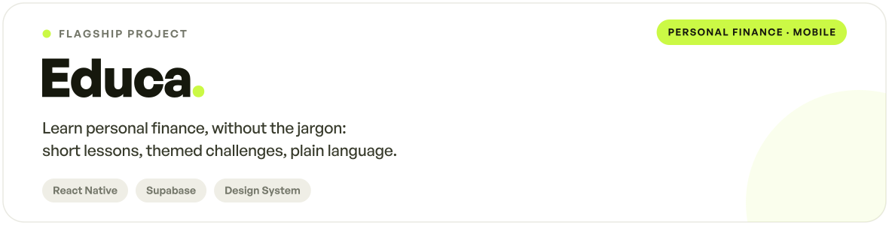
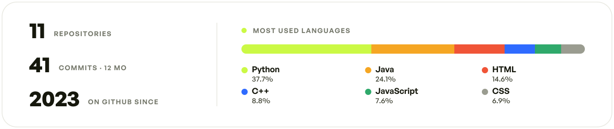

<!-- ══════════════════════  HERO  ══════════════════════ -->

  <picture>
    <source media="(prefers-color-scheme: dark)" srcset="brand/header-dark.svg">
    
  </picture>

 

<!-- ══════════════════════  ABOUT  ══════════════════════ -->

  <picture>
    <source media="(prefers-color-scheme: dark)" srcset="brand/sec-about-dark.svg">
    
  </picture>

  Hi, I'm <b>Michele</b> — a first-year <b>Computer Engineering</b> student at the <b>University of Pisa</b> (UniPi). 
  I build web and mobile apps, and I care about clean design and interfaces as much as the code behind them. 
  I'm especially drawn to products that teach — like <b>Educa</b>. It's all open source, and feedback is always welcome.

 

<!-- ══════════════════════  STACK  ══════════════════════ -->

  <picture>
    <source media="(prefers-color-scheme: dark)" srcset="brand/sec-stack-dark.svg">
    
  </picture>

 

  <picture>
    <source media="(prefers-color-scheme: dark)" srcset="brand/stack-dark.svg">
    
  </picture>

 

<!-- ══════════════════════  FEATURED PROJECT  ══════════════════════ -->

  <picture>
    <source media="(prefers-color-scheme: dark)" srcset="brand/sec-project-dark.svg">
    
  </picture>

 

  <picture>
    <source media="(prefers-color-scheme: dark)" srcset="brand/educa-card-dark.svg">
    
  </picture>

 

<!-- ══════════════════════  STATS  ══════════════════════ -->

  <picture>
    <source media="(prefers-color-scheme: dark)" srcset="brand/sec-stats-dark.svg">
    
  </picture>

 

  <picture>
    <source media="(prefers-color-scheme: dark)" srcset="brand/stats-dark.svg">
    
  </picture>

 

<!-- ══════════════════════  CONTACT  ══════════════════════ -->

  <picture>
    <source media="(prefers-color-scheme: dark)" srcset="brand/sec-contact-dark.svg">
    
  </picture>

 

  <a href="https://github.com/Mikexezy">
    <picture>
      <source media="(prefers-color-scheme: dark)" srcset="https://img.shields.io/github/followers/Mikexezy?style=for-the-badge&logo=github&logoColor=16180D&label=FOLLOW&labelColor=F2F2EC&color=CBF945">
      
    </picture>
  </a>
  <a href="https://www.instagram.com/michelepernacii/">
    <picture>
      <source media="(prefers-color-scheme: dark)" srcset="https://img.shields.io/badge/INSTAGRAM-F2F2EC?style=for-the-badge&logo=instagram&logoColor=16180D">
      
    </picture>
  </a>

