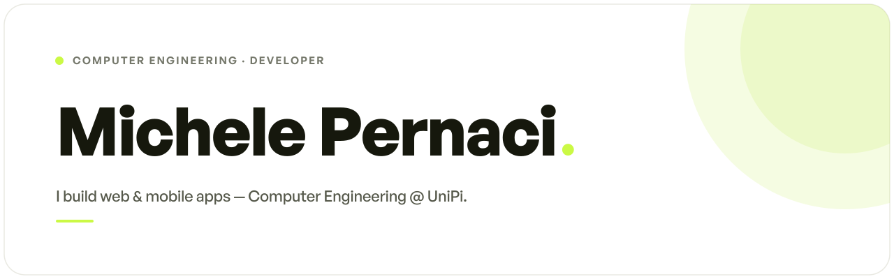
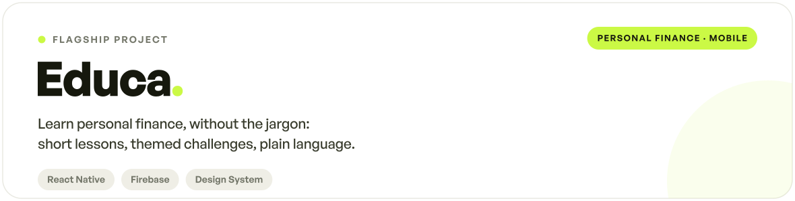

<!-- ══════════════════════  HERO  ══════════════════════ -->

  <picture>
    <source media="(prefers-color-scheme: dark)" srcset="assets/header-dark.svg">
    
  </picture>

 

<!-- ══════════════════════  ABOUT  ══════════════════════ -->

  <picture>
    <source media="(prefers-color-scheme: dark)" srcset="assets/sec-about-dark.svg">
    
  </picture>

  Hi, I'm <b>Michele</b> — a computer-science student who fell in love with building things for the web. 
  I'm in my fourth year, heading toward graduation and still happily torn between <b>computer science</b> and <b>mechatronics</b>. 
  Most of what I make are web (and mobile) apps — and it's all open source. Feedback is always welcome.

 

<!-- ══════════════════════  STACK  ══════════════════════ -->

  <picture>
    <source media="(prefers-color-scheme: dark)" srcset="assets/sec-stack-dark.svg">
    
  </picture>

 

  <picture>
    <source media="(prefers-color-scheme: dark)" srcset="assets/stack-dark.svg">
    
  </picture>

 

<!-- ══════════════════════  FEATURED PROJECT  ══════════════════════ -->

  <picture>
    <source media="(prefers-color-scheme: dark)" srcset="assets/sec-project-dark.svg">
    
  </picture>

 

  <picture>
    <source media="(prefers-color-scheme: dark)" srcset="assets/educa-card-dark.svg">
    
  </picture>

 

<!-- ══════════════════════  STATS  ══════════════════════ -->

  <picture>
    <source media="(prefers-color-scheme: dark)" srcset="assets/sec-stats-dark.svg">
    
  </picture>

 

  <picture>
    <source media="(prefers-color-scheme: dark)" srcset="https://github-readme-stats.vercel.app/api?username=Mikexezy&show_icons=true&hide_border=false&include_all_commits=true&count_private=true&title_color=CBF945&text_color=BCBEB3&icon_color=CBF945&bg_color=16180D&border_color=24271A&border_radius=16">
    
  </picture>
  &nbsp;
  <picture>
    <source media="(prefers-color-scheme: dark)" srcset="https://github-readme-stats.vercel.app/api/top-langs/?username=Mikexezy&layout=compact&hide_border=false&title_color=CBF945&text_color=BCBEB3&bg_color=16180D&border_color=24271A&border_radius=16">
    
  </picture>

 

<!-- ══════════════════════  CONTACT  ══════════════════════ -->

  <picture>
    <source media="(prefers-color-scheme: dark)" srcset="assets/sec-contact-dark.svg">
    
  </picture>

 

  <a href="https://github.com/Mikexezy">
    <picture>
      <source media="(prefers-color-scheme: dark)" srcset="https://img.shields.io/github/followers/Mikexezy?style=for-the-badge&logo=github&logoColor=16180D&label=FOLLOW&labelColor=F2F2EC&color=CBF945">
      
    </picture>
  </a>
  <a href="https://www.instagram.com/michelepernacii/">
    <picture>
      <source media="(prefers-color-scheme: dark)" srcset="https://img.shields.io/badge/INSTAGRAM-F2F2EC?style=for-the-badge&logo=instagram&logoColor=16180D">
      
    </picture>
  </a>

 

  <b>Michele Pernaci</b> · built with a custom <i>Educa</i> design system — warm ink, electric lime.

